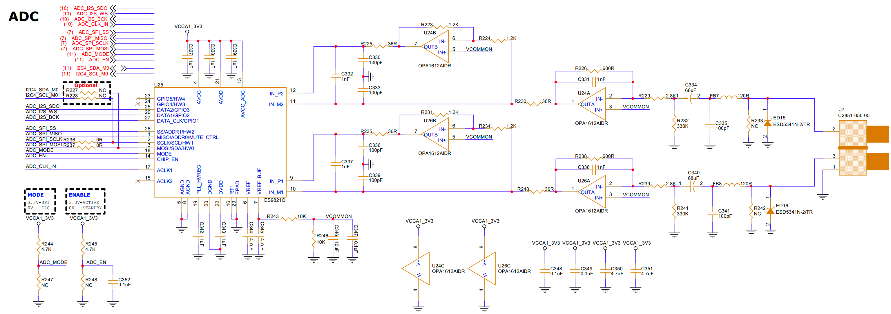

# ADC (Analog-to-Digital Converter) Interface Guide

## 1. Schematic



## 2. Device Tree (DTS) Configuration

```bash
/{
    es9821_sound: es9821-sound {
        status = "okay";
        compatible = "simple-audio-card";
        simple-audio-card,name = "ES9821";
        simple-audio-card,format = "i2s";
        simple-audio-card,mclk-fs = <1024>;

        simple-audio-card,cpu {
            sound-dai = <&i2s3_2ch>;
        };

        simple-audio-card,codec {
            sound-dai = <&es9821_codec>;
        };
    };
};

&i2s3_2ch {
    status = "okay";
    #sound-dai-cells = <0>;
    rockchip,trcm-sync-rx-only;
    i2s-lrck-gpio = <&gpio4 RK_PC4 GPIO_ACTIVE_HIGH>;
    pinctrl-names = "default";
    pinctrl-0 = <&i2s3m1_sclk
                 &i2s3m1_lrck
                 &i2s3m1_sdi>;
};

/* ADC ES9821Q */
&spi0 {
    status = "okay";
    pinctrl-names = "default";
    pinctrl-0 = <&spi0m0_pins &spi0m0_cs0>;
    num-cs = <1>;

    es9821_codec: es9821-codec@0 {
        status = "okay";
        compatible = "ess,es9821";
        reg = <0>;
        #sound-dai-cells = <0>;
        clocks = <&cru I2S3_MCLKOUT>;
        clock-names = "mclk";

        assigned-clocks = <&cru I2S3_MCLKOUT>, <&cru I2S3_MCLK_IOE>;
        assigned-clock-rates = <49152000>;
        assigned-clock-parents = <&cru I2S3_MCLKOUT_RX>, <&cru I2S3_MCLKOUT>;
        pinctrl-names = "default";
        pinctrl-0 = <&i2s3m1_mclk>;
    };
};


```

## 3. Testing

### 3.1 Clear Previous Recording

```bash
rm -rf output.wav > /dev/null
```

### 3.2 Record and Play Audio Simultaneously

Record audio from the ADC (2 channels, 44100 Hz sample rate, 16-bit signed little-endian format) and simultaneously play it through the DAC. The test audio file `test.wav` is located in the `resource` directory:


```bash
arecord -D hw:0,0 -c 2 -r 44100 -f s16_le output.wav | aplay -D hw:1,0 test.wav
```

### 3.3 Play Recorded Audio

```bash
aplay -D hw:2,0 output.wav
```

**Note:** Adjust the device numbers (hw:X,Y) based on your `aplay -l` and `arecord -l` output.