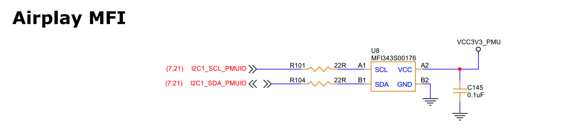

# Airplay MFI
## 1. Schematic


## 2. DTS
```bash
&i2c1 {
    status = "okay";
};
```

## 3. Detect I2C peripheral — device at address 0x10 detected
```bash
root@linaro-alip:/# i2cdetect -y 1
     0  1  2  3  4  5  6  7  8  9  a  b  c  d  e  f
00:                         -- -- -- -- -- -- -- -- 
10: 10 -- -- -- -- -- -- -- -- -- -- -- -- -- -- -- 
20: -- -- -- -- -- -- -- -- -- -- -- -- -- -- -- -- 
30: -- -- -- -- -- -- -- -- -- -- -- -- -- -- -- -- 
40: -- -- -- -- -- -- -- -- -- -- -- -- -- -- -- -- 
50: -- -- -- -- -- -- -- -- -- -- -- -- -- -- -- -- 
60: -- -- -- -- -- -- -- -- -- -- -- -- -- -- -- -- 
70: -- -- -- -- -- -- -- 

Read device data
root@linaro-alip:/# i2cdump -y 1 0x10
No size specified (using byte-data access)
     0  1  2  3  4  5  6  7  8  9  a  b  c  d  e  f    0123456789abcdef
00: XX 00 00 00 00 00 00 00 00 00 00 00 00 00 00 00    X...............
10: 00 00 00 00 00 00 00 00 00 00 00 00 00 00 00 00    ................
20: 00 00 00 00 00 00 00 00 00 00 00 00 00 00 00 00    ................
30: 00 00 00 00 00 00 00 00 00 00 00 00 00 00 00 00    ................
40: 00 00 00 00 00 00 00 00 00 00 00 00 00 00 00 00    ................
50: 00 00 00 00 00 00 00 00 00 00 00 00 00 00 00 00    ................
60: 00 00 00 00 00 00 00 00 00 00 00 00 00 00 00 00    ................
70: 00 00 00 00 00 00 00 00 00 00 00 00 00 00 00 00    ................
80: 00 00 00 00 00 00 00 00 00 00 00 00 00 00 00 00    ................
90: 00 00 00 00 00 00 00 00 00 00 00 00 00 00 00 00    ................
a0: 00 00 00 00 00 00 00 00 00 00 00 00 00 00 00 00    ................
b0: 00 00 00 00 00 00 00 00 00 00 00 00 00 00 00 00    ................
c0: 00 00 00 00 00 00 00 00 00 00 00 00 00 00 00 00    ................
d0: 00 00 00 00 00 00 00 00 00 00 00 00 00 00 00 00    ................
e0: 00 00 00 00 00 00 00 00 00 00 00 00 00 00 00 00    ................
f0: 00 00 00 00 00 00 00 00 00 00 00 00 00 00 00 00    ................
```