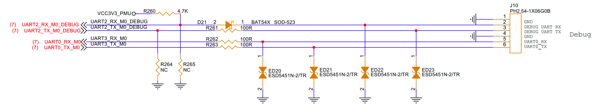

# DEBUG UART Interface Guide

## 1. Schematic

The J10 connector in the physical diagram corresponds to this interface. The pin marked with a triangle indicates pin 1.

## 2. Testing

Connect the serial port with the baud rate set to 1500000. After powering on, log output should appear.