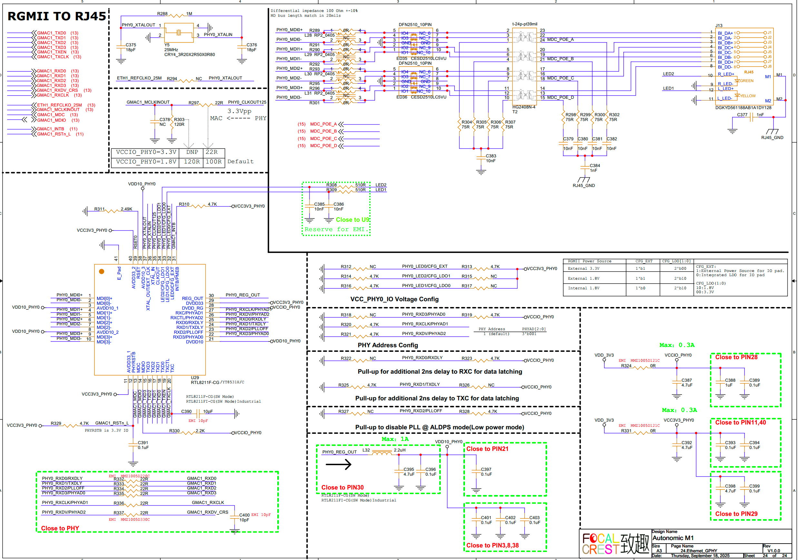
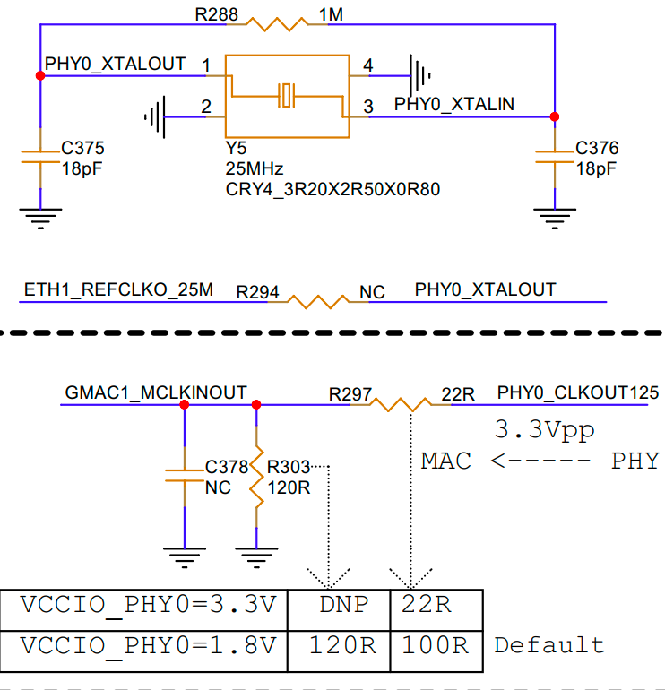

# GMAC Ethernet Interface Guide

## 1. Schematic



## 2. Using GMAC1 Controller

**Pin Configuration:**

| PIN | GPIO |
|-----|------|
| GMAC1_INTB | GPIO4_A5_d |
| GMAC1_RSTn_L | GPIO4_C1_d |



**RGMII Mode:** The TXCLK clock required by RGMII mode is provided by the PHY, and the PHY 25M clock is provided by the crystal oscillator.

## 3. Device Tree (DTS) Configuration

```dts
&gmac1 {
    phy-mode = "rgmii";
    clock_in_out = "input";

    snps,reset-gpio = <&gpio4 RK_PC1 GPIO_ACTIVE_LOW>;
    snps,reset-active-low;
    /* Reset time is 20ms, 100ms for rtl8211f */
    snps,reset-delays-us = <0 20000 100000>;

    assigned-clocks = <&cru SCLK_GMAC1_RX_TX>, <&cru SCLK_GMAC1_RGMII_SPEED>, <&cru SCLK_GMAC1>;
    assigned-clock-parents = <&cru SCLK_GMAC1_RGMII_SPEED>, <&cru SCLK_GMAC1>, <&gmac1_clkin>;
    assigned-clock-rates = <0>, <125000000>;

    pinctrl-names = "default";
    pinctrl-0 = <&gmac1m0_miim
                    &gmac1m0_tx_bus2
                    &gmac1m0_rx_bus2
                    &gmac1m0_rgmii_clk
                    &gmac1m0_clkinout
                    &gmac1m0_rgmii_bus>;

    tx_delay = <0x4f>;
    rx_delay = <0x25>;

    phy-handle = <&rgmii_phy1>;
    status = "okay";
};

&mdio1 {
    rgmii_phy1: phy@0 {
        compatible = "ethernet-phy-ieee802.3-c22";
        reg = <0x0>;
    };
};

```

## 4. Testing

1. Connect an Ethernet cable to the interface.
2. Check if an IP address is assigned:

```bash
ifconfig eth1
```

3. Check the negotiated speed (maximum supported: 1000Mbps):

```bash
cat /sys/class/net/eth1/speed
1000
```

## 5. Troubleshooting