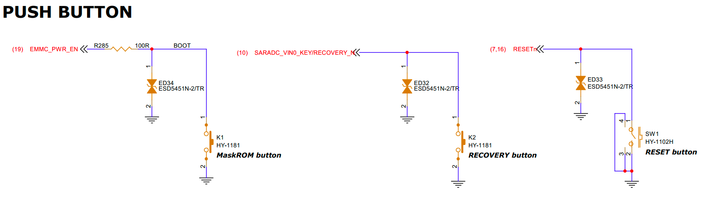

# Button Interface Guide

## 1. Schematic

## 2. Testing

### K1 BOOT

Hold the BOOT button while powering on to enter MaskRom mode.

### K2 RECOVERY

**Note:** Connect the Download USB port to your computer before testing.

Hold the RECOVERY button while powering on to enter Loader mode.

### K3 RESET

Reset button.