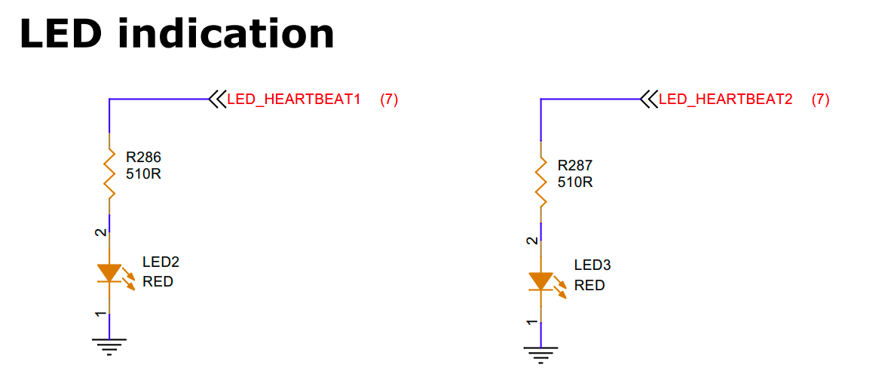

# LED Interface Guide

## 1. Schematic


## 2. Device Tree (DTS)

```dts
leds: leds {
    compatible = "gpio-leds";
    status = "okay";

    sys_status_led: sys-status-led {
        label = "sys_status_led";
        linux,default-trigger = "heartbeat";
        gpios = <&gpio0 RK_PB7 GPIO_ACTIVE_HIGH>;
        pinctrl-names = "default";
        pinctrl-0 = <&sys_status_led_pin>;
    };

    power_status_led: power-status-led {
        label = "power_status_led";
        linux,default-trigger = "heartbeat";
        gpios = <&gpio0 RK_PA0 GPIO_ACTIVE_HIGH>;
        pinctrl-names = "default";
        pinctrl-0 = <&power_status_led_pin>;
    };
};

```

## 3. Testing

The device status LEDs should blink.