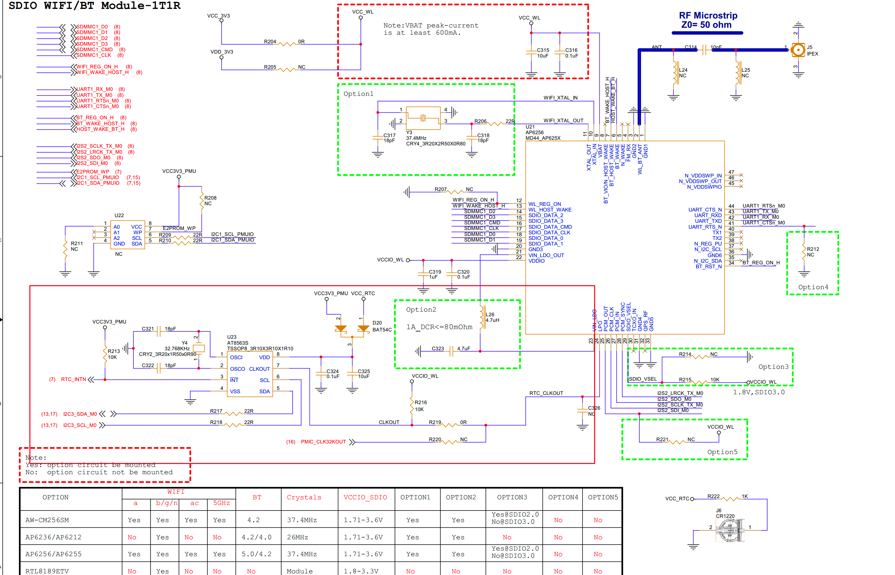

# RTC (Real-Time Clock) Interface Guide

## 1. Schematic


| PIN | GPIO |
|-----|------|
| RTC_INT | GPIO0_C2_d |

## 2. Device Tree (DTS) Configuration

```dts
&i2c3 {
    pinctrl-names = "default";
    pinctrl-0 = <&i2c3m0_xfer>;
    status = "okay";

    hym8563: hym8563@51 {
        compatible = "haoyu,hym8563";
        reg = <0x51>;
        #clock-cells = <0>;
        clock-frequency = <32768>;
        clock-output-names = "hym8563";
        pinctrl-names = "default";
        pinctrl-0 = <&hym8563_int>;
        interrupt-parent = <&gpio0>;
        interrupts = <RK_PC2 IRQ_TYPE_LEVEL_LOW>;
        wakeup-source;
    };
};

&pinctrl {
    hym8563 {
        hym8563_int: hym8563-int {
            rockchip,pins = <0 RK_PC2 RK_FUNC_GPIO &pcfg_pull_up>;
        };
    };
};
```

## 3. Basic Usage and Testing

System log showing RTC information:

```
root@rk3566-buildroot:/# dmesg | grep rtc
[    2.867553] rtc-hym8563 5-0051: rtc information is valid
[    2.874808] rtc-hym8563 5-0051: registered as rtc0
[    2.875842] rtc-hym8563 5-0051: setting system clock to 2021-01-02T07:20:08 UTC (1609572008)
```

### 3.1 Common RTC Testing Commands

#### 3.1.1 List RTC Devices Detected by System

```bash
ls -l /dev/rtc*
```

Expected output:

```
/dev/rtc -> rtc0
/dev/rtc0
```

#### 3.1.2 Read Current RTC Time

```bash
hwclock -r
```

Example output:

```
Sat Jan  2 07:20:45 2021  0.000000 seconds
```

Read current system time:

```bash
date
```

Example output:

```
Sat Jan  2 07:22:13 UTC 2021
```

#### 3.1.3 Modify Time and Write System Time to RTC

```bash
date -s "2025-10-30 15:42:00"
hwclock -w
```

Verify RTC time matches system time:

```bash
root@rk3566-buildroot:/# hwclock -r
Sat Jan  2 07:24:31 2021  0.000000 seconds
root@rk3566-buildroot:/# date -s "2025-10-30 15:42:00"
Thu Oct 30 15:42:00 UTC 2025
root@rk3566-buildroot:/# hwclock -w
root@rk3566-buildroot:/# hwclock -r
Thu Oct 30 15:42:04 2025  0.000000 seconds
```

#### 3.1.4 Update System Time from RTC (Manual Synchronization)

```bash
hwclock -s
```

## 4. Troubleshooting