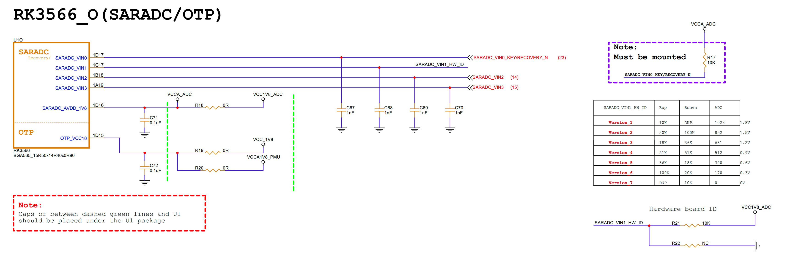
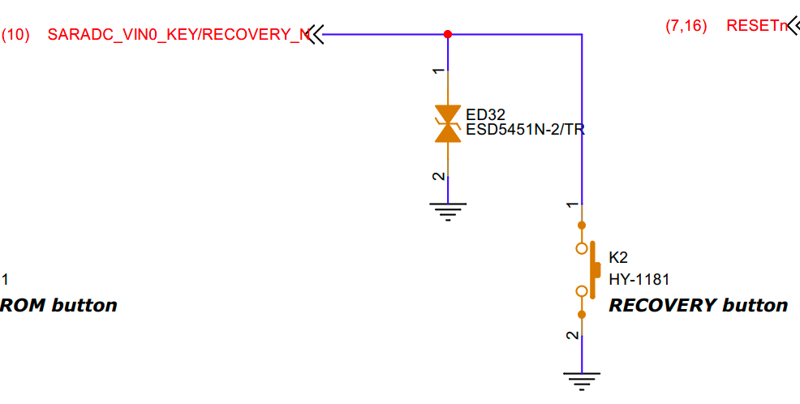
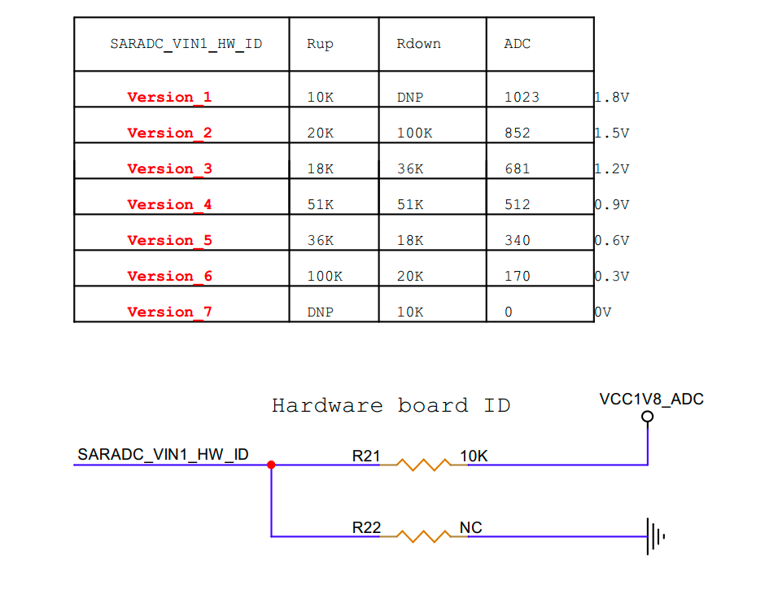
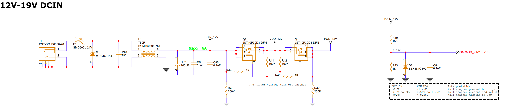
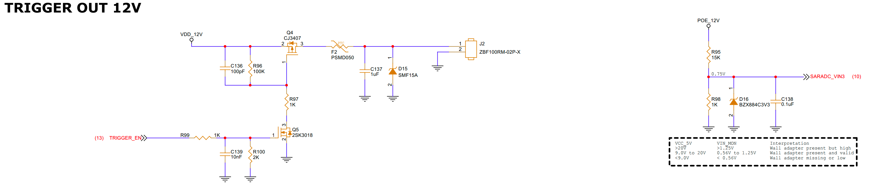

1. Schematic


VIN0: (Recovery button)


VIN1: (Hardware version detection)


VIN2: (DC power detection)


VIN3: (POE power detection / trigger out)


2. DTS
```dts
&saradc {
    status = "okay";
    vref-supply = <&vcc_1v8>;
};
```

3. Simple test
A test script named read-adc.sh is used. Run it with:
```bash
bash read-adc.sh
```

Contents of read-adc.sh:
```sh
#!/bin/sh

ADC_PATH="/sys/bus/iio/devices/iio:device0"
ADC_MAX=1023
VREF=1.8

echo "ADC Value & Voltage:"
echo "-----------------------------------------"

for f in $ADC_PATH/in_voltage*_raw; do
    ch=$(basename $f)
    raw=$(cat $f)

    # Use awk for floating point calculation
    voltage=$(awk -v r="$raw" -v max="$ADC_MAX" -v vref="$VREF" \
        'BEGIN { printf "%.2f", r * vref / max }')

    echo "$ch = $raw   →   ${voltage} V"
done
```

Example output:
```
ADC Value & Voltage:
-----------------------------------------
in_voltage0_raw = 1023   →   1.80 V
in_voltage1_raw = 1023   →   1.80 V
in_voltage2_raw = 441    →   0.78 V
in_voltage3_raw = 431    →   0.76 V
......
```

Interpretation (focus on the first four channels):
- in_voltage0_raw
  - 1023: recovery button not pressed
  - 0 ~ 20: recovery button pressed
- in_voltage1_raw
  - 1023: current hardware version = version_1
- in_voltage2_raw
  - ~400: DC power present
  - 0 ~ 20: DC power not present
- in_voltage3_raw
  - ~400: POE power present
  - 0 ~ 20: POE power not present
