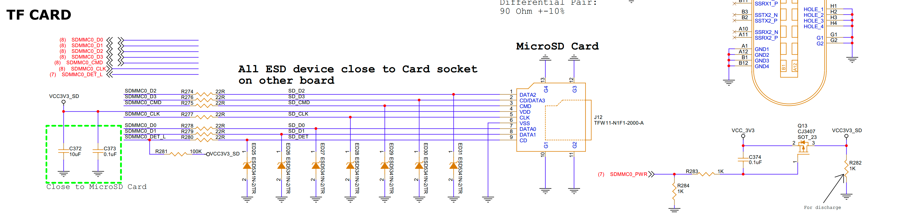

# SDMMC (SD/MMC) Interface Guide

## 1. Schematic



| PIN | GPIO |
|-----|------|
| SDMMC0_PWR | GPIO0_A5_d |

## 2. Device Tree (DTS) Configuration

```dts
vcc3v3_sd: vcc3v3-sd {
    compatible = "regulator-fixed";
    regulator-name = "vcc3v3_sd";
    regulator-min-microvolt = <3300000>;
    regulator-max-microvolt = <3300000>;
    enable-active-low;
    regulator-boot-on;
    regulator-always-on;
    gpio = <&gpio0 RK_PA5 GPIO_ACTIVE_LOW>;
    vin-supply = <&vccio_sd>;
};

&sdmmc0 {
    max-frequency = <150000000>;
    supports-sd;
    bus-width = <4>;
    cap-mmc-highspeed;
    cap-sd-highspeed;
    disable-wp;
    sd-uhs-sdr104;
    vmmc-supply = <&vcc3v3_sd>;
    vqmmc-supply = <&vccio_sd>;
    pinctrl-names = "default";
    pinctrl-0 = <&sdmmc0_bus4 &sdmmc0_clk &sdmmc0_cmd &sdmmc0_det>;
    status = "okay";
};
```

## 3. Basic Usage and Testing

### 3.1 Insertion Log

```
[  770.995927] mmc_host mmc1: Bus speed (slot 0) = 375000Hz (slot req 400000Hz, actual 375000HZ div = 0)
[  771.650909] mmc_host mmc1: Bus speed (slot 0) = 148500000Hz (slot req 150000000Hz, actual 148500000HZ div = 0)
[  771.733425] dwmmc_rockchip fe2b0000.mmc: Successfully tuned phase to 270
[  771.733559] mmc1: new ultra high speed SDR104 SDHC card at address 0001
[  771.735859] mmcblk1: mmc1:0001 SD 14.6 GiB 
[  772.433286] EXT4-fs (mmcblk1): recovery complete
[  772.433406] EXT4-fs (mmcblk1): mounted filesystem with ordered data mode. Quota mode: disabled.
```

### 3.2 Common Testing Commands

#### 3.2.1 View TF Card Device

```bash
ls -l /dev/mmcblk1*
```

#### 3.2.2 View Disk Capacity

```bash
fdisk -l /dev/mmcblk1
```

Example output:

```
Disk /dev/mmcblk1: 15 GB, 15634268160 bytes, 30535680 sectors
477120 cylinders, 4 heads, 16 sectors/track
Units: sectors of 1 * 512 = 512 bytes
......
```

#### 3.2.3 Mount SD Card

```bash
mount /dev/mmcblk1p1 /mnt/sdcard
```

#### 3.2.4 View Mounted Filesystems

```bash
df -h
```

#### 3.2.5 Unmount SD Card

```bash
umount /mnt/sdcard
```

## 4. Troubleshooting