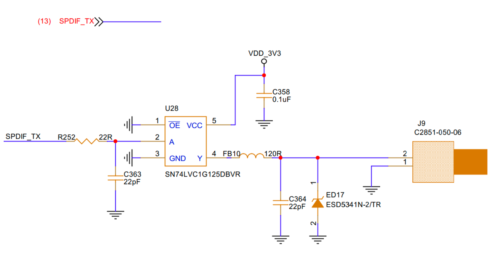

# SPDIF Audio Interface Design and Testing Guide

## 1. Schematic


SPDIF (Sony/Philips Digital Interface Format) is a digital audio signal interface standard used to transmit stereo audio signals between devices, such as from onboard SoC output to amplifiers and audio systems.

## 2. Device Tree (DTS) Configuration

The following is a typical DTS snippet example for SPDIF output (applicable to Rockchip platform):

```dts
spdif-sound {
    status = "okay";
    compatible = "simple-audio-card";
    simple-audio-card,name = "ROCKCHIP,SPDIF";
    simple-audio-card,mclk-fs = <128>;
    simple-audio-card,cpu {
                    sound-dai = <&spdif_8ch>;
    };
    simple-audio-card,codec {
                    sound-dai = <&spdif_out>;
    };
};

spdif_out: spdif-out {
    status = "okay";
    compatible = "linux,spdif-dit";
    #sound-dai-cells = <0>;
};

&spdif_8ch {
    status = "okay";
    pinctrl-names = "default";
    pinctrl-0 = <&spdifm0_tx>;
};
```

## 3. System Testing

### 3.1 Verify Device Recognition

Execute the command:

```bash
aplay -l
```

You should see the sound card device corresponding to SPDIF, for example:

```
card 2: SPDIF [ROCKCHIP,SPDIF], device 0: SPDIF PCM
```

### 3.2 Play Test Audio File

Execute the command:
The test audio file `test.wav` is located in the `resource` directory:

```bash
aplay -D hw:2,0 test.wav
```

If the connection is normal, the amplifier or speaker should produce sound output.

**Note:** `hw:2,0` represents device 0 of sound card 2. Adjust according to your `aplay -l` results.