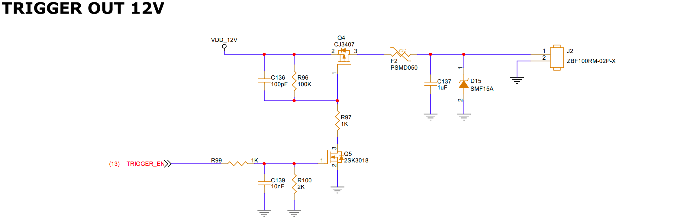

# TRIGGER-OUT 12V Guide

## 1. Schematic


## 2. Device Tree (DTS)

```dts
leds: leds {
    compatible = "gpio-leds";
    status = "okay";

    ......

    power_ctrl: power-ctrl {
        label = "power_ctrl";
        gpios = <&gpio1 RK_PA5 GPIO_ACTIVE_HIGH>;
        default-state = "off";
        pinctrl-names = "default";
        pinctrl-0 = <&power_ctrl_pin>;
    };
};
```

The power control is multiplexed with the LED function.

Power control operations:
- Turn on power:
```bash
echo 1 > /sys/class/leds/power_ctrl/brightness
```

- Turn off power:
```bash
echo 0 > /sys/class/leds/power_ctrl/brightness
```
