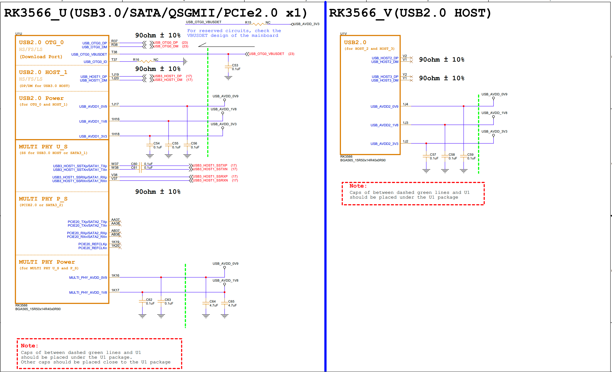
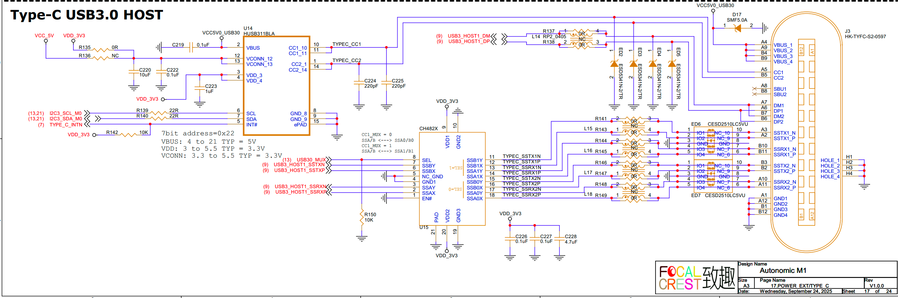

# USB Interface Guide

## 1. Schematic

## 2. Testing USB 3.0

1. Connect a USB 3.0 device to the J3 port.
2. Check the serial port log to verify if the superspeed device is recognized. The device should be detected regardless of connector orientation.
3. USB hubs can also be used for testing.