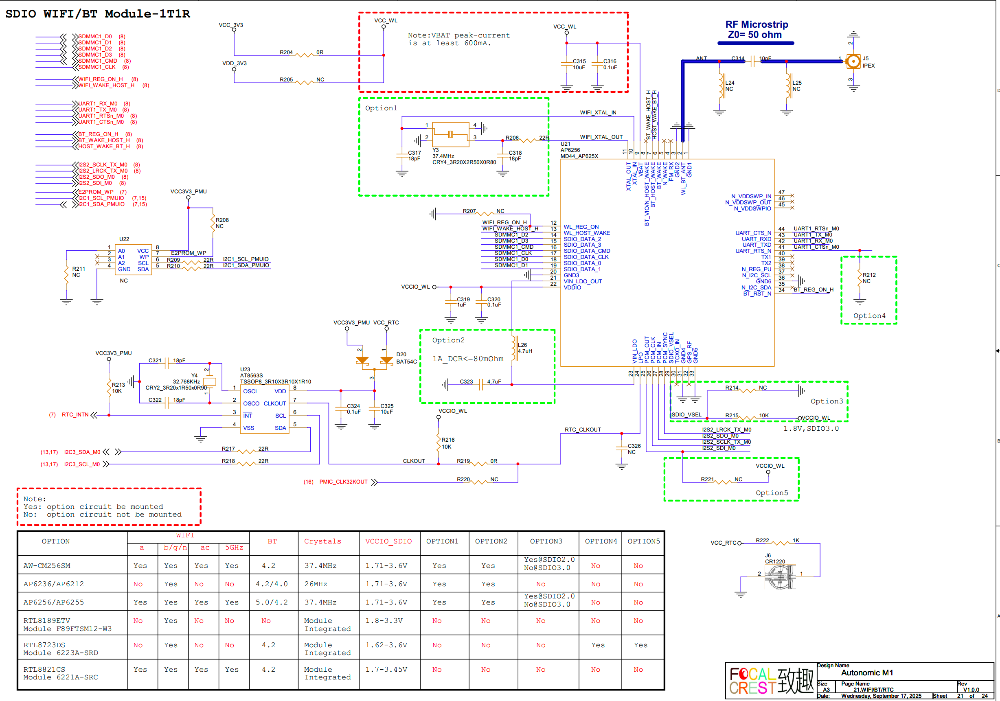

# WIFI and Bluetooth Interface Guide

## 1. Schematic



### SDIO - WiFi Pins

| PIN | GPIO |
|-----|------|
| WIFI_REG_ON_H | GPIO2_B1_d |
| WIFI_WAKE_HOST_H | GPIO2_B2_u |

### UART - Bluetooth Pins

| PIN | GPIO |
|-----|------|
| UART1_RX_M0 | GPIO2_B3_u |
| UART1_TX_M0 | GPIO2_B4_u |
| UART1_RTSn_M0 | GPIO2_B5_u |
| UART1_CTSn_M0 | GPIO2_B6_u |

### Bluetooth Control Pins

| PIN | GPIO |
|-----|------|
| BT_REG_ON_H | GPIO2_B7_d |
| BT_WAKE_HOST_H | GPIO2_C0_d |
| HOST_WAKE_BT_H | GPIO2_C1_d |

### I2S Audio Pins

| PIN | GPIO |
|-----|------|
| I2S2_SCLK_TX_M0 | GPIO2_C2_d |
| I2S2_LRCK_TX_M0 | GPIO2_C3_d |
| I2S2_SDO_M0 | GPIO2_C4_d |
| I2S2_SDI_M0 | GPIO2_C5_d |

## 2. Device Tree (DTS) Configuration

```dts
/{
   wireless_bluetooth: wireless-bluetooth {
        compatible = "bluetooth-platdata";
        clocks = <&hym8563>;
        clock-names = "ext_clock";
        uart_rts_gpios = <&gpio2 RK_PB5 GPIO_ACTIVE_LOW>;
        pinctrl-names = "default", "rts_gpio";
        pinctrl-0 = <&uart1m0_rtsn>,  <&bt_reset_gpio>, <&bt_wake_gpio>, <&bt_irq_gpio>;
        pinctrl-1 = <&uart1_gpios>;
        BT,reset_gpio    = <&gpio2 RK_PB7 GPIO_ACTIVE_HIGH>;
        BT,wake_gpio     = <&gpio2 RK_PC0 GPIO_ACTIVE_HIGH>;
        BT,wake_host_irq = <&gpio2 RK_PC1 GPIO_ACTIVE_HIGH>;
        status = "okay";
    };

    wireless_wlan: wireless-wlan {
        compatible = "wlan-platdata";
        rockchip,grf = <&grf>;
        wifi_chip_type = "ap6256";
        pinctrl-names = "default";
        pinctrl-0 = <&wifi_host_wake_irq>;
        WIFI,host_wake_irq = <&gpio2 RK_PB2 GPIO_ACTIVE_HIGH>;
        WIFI,poweren_gpio = <&gpio2 RK_PB1 GPIO_ACTIVE_HIGH>;
        status = "okay";
    };
};


&uart1 {
            pinctrl-names = "default";
            pinctrl-0 = <&uart1m0_xfer &uart1m0_ctsn>;
            status = "okay";
 };

&pinctrl {
    hym8563 {
        hym8563_int: hym8563-int {
            rockchip,pins = <0 RK_PC2 RK_FUNC_GPIO &pcfg_pull_up>;
        };
    };

    sdio-pwrseq {
        wifi_enable_h: wifi-enable-h {
            rockchip,pins = <2 RK_PB1 RK_FUNC_GPIO &pcfg_pull_none>;
        };
    };

    wireless-bluetooth {
        uart1_gpios: uart1-gpios {
            rockchip,pins = <2 RK_PB5 RK_FUNC_GPIO &pcfg_pull_none>;
        };

        bt_reset_gpio: bt-reset-gpio {
            rockchip,pins = <2 RK_PB7 RK_FUNC_GPIO &pcfg_pull_none>;
        };

        bt_wake_gpio: bt-wake-gpio {
            rockchip,pins = <2 RK_PC0 RK_FUNC_GPIO &pcfg_pull_none>;
        };

        bt_irq_gpio: bt-irq-gpio {
            rockchip,pins = <2 RK_PC1 RK_FUNC_GPIO &pcfg_pull_down>;
        };
    };

    wireless-wlan {
        wifi_host_wake_irq: wifi-host-wake-irq {
            rockchip,pins = <2 RK_PB2 RK_FUNC_GPIO &pcfg_pull_down>;
        };
    };
};


&i2c3 {
    pinctrl-names = "default";
    pinctrl-0 = <&i2c3m0_xfer>;
    status = "okay";

    hym8563: hym8563@51 {
        compatible = "haoyu,hym8563";
        reg = <0x51>;
        #clock-cells = <0>;
        clock-frequency = <32768>;
        clock-output-names = "hym8563";
        pinctrl-names = "default";
        pinctrl-0 = <&hym8563_int>;
        interrupt-parent = <&gpio0>;
        interrupts = <RK_PC1 IRQ_TYPE_LEVEL_LOW>;
        wakeup-source;
    };
};

```

## 3. WiFi STA Testing

### 3.1 Load Driver and Bring Up Interface

After loading the driver, you should see `wlan0` when running:

```bash
ifconfig -a
```

Enable WiFi:

```bash
ifconfig wlan0 up
```

### 3.2 Start wpa_supplicant

```bash
wpa_supplicant -B -i wlan0 -c /data/cfg/wpa_supplicant.conf
```

### 3.3 Configuration File

Create `/data/cfg/wpa_supplicant.conf`:

```
ctrl_interface=/var/run/wpa_supplicant
ap_scan=1
update_config=1

network={
    ssid="WiFi-AP"
    psk="12345678"
    key_mgmt=WPA-PSK
}
```

**Note:** For open networks without encryption, use `key_mgmt=NONE`

### 3.4 Disable WiFi

```bash
ifconfig wlan0 down
killall wpa_supplicant
```

### 3.5 Scan Nearby Access Points

Ensure `wpa_supplicant` is running:

```bash
wpa_cli -i wlan0 -p /var/run/wpa_supplicant scan
wpa_cli -i wlan0 -p /var/run/wpa_supplicant scan_results
```

### 3.6 Connect to Router

Add network configuration to `/data/cfg/wpa_supplicant.conf`:

```
network={
    ssid="WiFi-AP"
    psk="12345678"
    key_mgmt=WPA-PSK
}
```

Reload configuration:

```bash
wpa_cli -i wlan0 -p /var/run/wpa_supplicant reconfigure
```

Initiate connection:

```bash
wpa_cli -i wlan0 -p /var/run/wpa_supplicant reconnect
```

Check connection status:

```bash
wpa_cli -i wlan0 -p /var/run/wpa_supplicant status
```

Example output:

```
bssid=04:42:1a:b4:e7:7c
freq=5805
ssid=wwc3
id=0
mode=station
wifi_generation=6
pairwise_cipher=CCMP
group_cipher=CCMP
key_mgmt=SAE
pmf=2
mgmt_group_cipher=BIP
sae_group=19
sae_h2e=0
sae_pk=0
wpa_state=COMPLETED
ip_address=192.168.50.169
address=d4:9c:dd:f5:52:c4
uuid=47ed7266-da34-5c0b-884a-4fcc17648d87
ieee80211ac=1
```

## 4. Bluetooth Testing

### 4.1 Startup Sequence

```bash
killall brcm_patchram_plus1
echo 0 > /sys/class/rfkill/rfkill0/state
echo 0 > /proc/bluetooth/sleep/btwrite
sleep 2
echo 1 > /sys/class/rfkill/rfkill0/state
echo 1 > /proc/bluetooth/sleep/btwrite
sleep 2
brcm_patchram_plus1 --bd_addr_rand --enable_hci --no2bytes --use_baudrate_for_download --tosleep 200000 --baudrate 1500000 --patchram /system/etc/firmware/bcm43438a1.hcd /dev/ttyS4 &
```

**Note:** Kill the `brcm_patchram_plus1` process before each startup test.

### 4.2 Bluetooth Scan

```bash
hcitool scan
```

## 5. Quick Test Commands

### 5.1 Scan Nearby WiFi Networks

```bash
iw wlan0 scan | egrep "SSID|signal"
```

### 5.2 Scan Nearby Bluetooth Devices

```bash
bluetoothctl --timeout 5 scan on
```